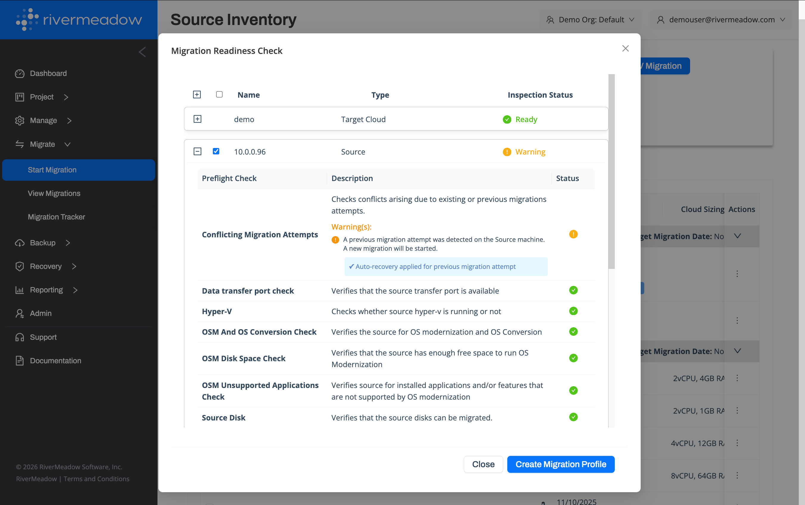
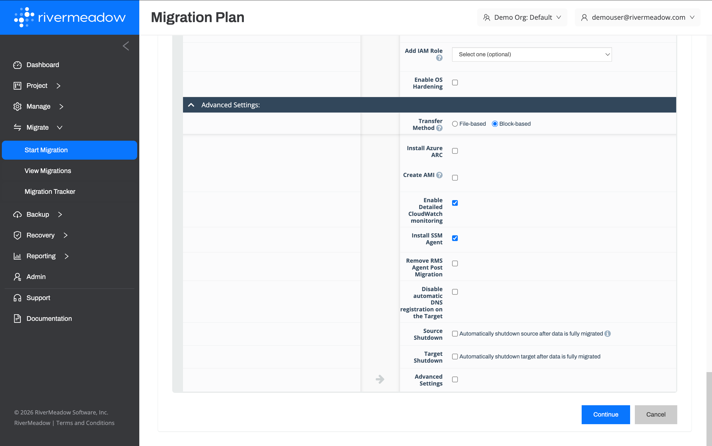
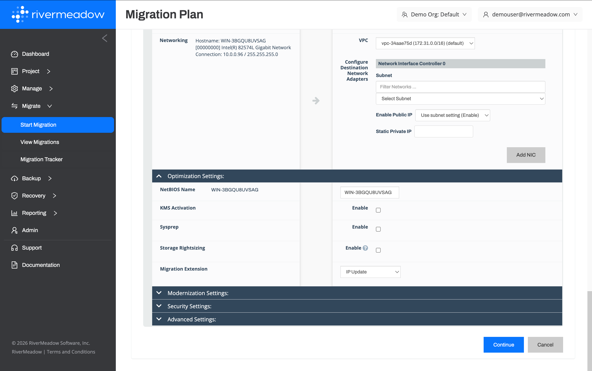

# Workload Mobility
---

Rapidly migrate workloads from any source to over a dozen supported targets with 200+ preflight migration checks, integrated automation, and a post-migration automation engine to identify potential migration issues and automate time-consuming post migration tasks.

* Derisked Migrations
* Rapid Migrations

## Mobility Features

The following platform features enable rapid mobility:

### Preflight Migration Checks

200+ integrated preflight migration checks are executed at various stages of the migration process to provide visibility into common issues that can prevent a successful migration.

**Preflight Migration Checks**

#### Key Benefits

The following are key benefits of the operating system modernization feature:

* **Reduced Cloud Costs:** The clone based methodology reduces the risk associated with in-place upgrades that rely on snapshots and commonly require an extended period of downtime simply for testing the upgrade.

### Integrated Automation

Automated removal of existing virtualization tooling (i.e. - VMware tools, Virtio drivers, etc.) and installation of virtualization tooling applicable to the target platform.

**Integrated Automation**

#### Key Benefits

The following are key benefits of the operating system modernization feature:

* **Reduced Cloud Costs:** The clone based methodology reduces the risk associated with in-place upgrades that rely on snapshots and commonly require an extended period of downtime simply for testing the upgrade.

### Migration Extensions (Custom Automation)

Automate post migration tasks such as agent removal or installation using the integrated automation engine.

**Migration Extension**

#### Key Benefits

The following are key benefits of the operating system modernization feature:

* **Reduced Cloud Costs:** The clone based methodology reduces the risk associated with in-place upgrades that rely on snapshots and commonly require an extended period of downtime simply for testing the upgrade.

## Migration Sources
The RiverMeadow platform migrating workloads from effectively any source including physical servers, virtual machines, and public cloud instances.

### Supported Operating Systems

The RiverMeadow platform supports the most common versions of Windows and Linux.

  
**Windows Operating Systems**

The RiverMeadow platform supports migrating the following Windows Operating Systems:

* Windows Server 2008 R2
* Windows Server 2012
* Windows Server 2016
* Windows Server 2019
* Windows Server 2022
* Windows Server 2025
* Windows 7
* Windows 8
* Windows 10
* Windows 11

:::warning
The operating system must be supported on the target hypervisor or cloud.
:::

  
**Linux Operating Systems**

The RiverMeadow platform supports migrating the following Linux Operating Systems:

* Amazon Linux 2
* Amazon Linux 2023
* Azure Linux 3.0
* CentOS 6
* CentOS 7
* CentOS 8 Stream
* Debian 9
* Debian 10
* Debian 11
* Debian 12
* Oracle Enterprise Linux 6
* Oracle Enterprise Linux 7
* Oracle Enterprise Linux 8
* Oracle Enterprise Linux 9
* Red Hat Enterprise Linux (RHEL) 6.x
* Red Hat Enterprise Linux (RHEL) 7.x
* Red Hat Enterprise Linux (RHEL) 8.x
* Red Hat Enterprise Linux (RHEL) 9.x
* Red Hat Enterprise Linux (RHEL) 10.x
* Red Hat Fedora
* SUSE Linux Enterprise Server 11
* SUSE Linux Enterprise Server 12
* SUSE Linux Enterprise Server 15
* SUSE openSUSE 11
* SUSE openSUSE 12
* SUSE openSUSE 13
* SUSE openSUSE 15
* Ubuntu 14
* Ubuntu 16
* Ubuntu 18
* Ubuntu 20
* Ubuntu 22
* Ubuntu 24

:::warning
The operating system must be supported on the target hypervisor or cloud.
:::

:::tip

A detailed list of the supported versions of Microsoft SQL Server that can be upgraded is available in the RiverMeadow documentation: (https://docs.rivermeadow.com/support-matrix-for-app-modernization)

:::

## Migration Targets
RiverMeadow provides a single unified platform to migrate workloads to over a dozen public cloud and on-premises virtualization platforms. This extensive support allows the platform to be utilized for hybrid migrations that include multiple migration targets (i.e. - AWS, Azure, and Red Hat OpenShift).

  
**Public Cloud Targets**

  The RiverMeadow platform supports the most popular public cloud IaaS solutions including cloud hosted versions of hypervisors from vendors such as Red Hat, Nutanix, and VMware to address various use cases.

| Name | Description | Type |
|:------:|:-------------:|:------:|
| [**AWS EC2**](https://aws.amazon.com/ec2/)| Amazon Elastic Compute Cloud (Amazon EC2) provides on-demand, scalable computing capacity in the Amazon Web Services (AWS) Cloud | Public Cloud IaaS |
| [**Elastic VMware Service (EVS)**](https://aws.amazon.com/evs/) | Amazon EVS is a native AWS service to run VMware Cloud Foundation (VCF) within your Amazon Virtual Private Cloud (Amazon VPC) | Cloud Hosted Hypervisor |
| [**Nutanix Cloud Clusters (NC2) on AWS**](https://www.nutanix.com/products/nutanix-cloud-clusters/aws) | NC2 on AWS is a hybrid cloud platform that enables your applications to run in a variety of on-premises private or public clouds and edge environments, all operated as a single cloud | Cloud Hosted Hypervisor |
| [**Red Hat OpenShift on AWS (ROSA)**](https://www.redhat.com/en/technologies/cloud-computing/openshift/aws) | A fully managed turnkey application platform that allows organizations to increase operational efficiency, refocus on innovation, and quickly build, deploy, and scale applications in a native AWS environment | Cloud Hosted Hypervisor |
| [**Microsoft Azure**](https://azure.microsoft.com/en-us) | Create Linux and Windows virtual machines (VMs) in seconds and reduce costs. Build, deploy, and run your applications on resilient and scalable infrastructure | Public Cloud IaaS |
| [**Azure VMware Solution (AVS)**](https://azure.microsoft.com/en-us/products/azure-vmware) | Azure VMware Solution provides private clouds that contain VMware vSphere clusters built from dedicated bare-metal Azure infrastructure | Cloud Hosted Hypervisor |
| [**Nutanix Cloud Clusters (NC2) on Azure**](https://www.nutanix.com/products/nutanix-cloud-clusters/azure) | NC2 on Azure is a hybrid cloud platform that enables your applications to run in a variety of on-premises private or public clouds and edge environments, all operated as a single cloud | Cloud Hosted Hypervisor |
| [**Azure Red Hat OpenShift (ARO)**](https://www.redhat.com/en/technologies/cloud-computing/openshift/azure) | A fully managed turnkey application platform that helps organizations increase operational efficiency, focus on innovation, and quickly build, deploy, and scale applications | Cloud Hosted Hypervisor |
| [**Google Compute Engine (GCE)**](https://cloud.google.com/products/compute) | Compute Engine is a computing and hosting service that lets you create and run virtual machines on Google infrastructure | Public Cloud IaaS |
| [**Google Cloud VMware Engine (GCVE)**](https://cloud.google.com/vmware-engine) | A fully managed service letting businesses run their VMware environments (vSphere, vCenter, vSAN) directly on Google Cloud's bare-metal infrastructure, enabling seamless migration and modernization of existing apps without rewriting them, integrating familiar VMware tools with powerful Google Cloud services | Cloud Hosted Hypervisor |
| [**OpenShift Dedicated**](https://www.redhat.com/en/technologies/cloud-computing/openshift/dedicated) | Red Hat® OpenShift® Dedicated is a managed Red Hat OpenShift offering, available on Google Cloud | Cloud Hosted Hypervisor|
| [**Nutanix Cloud Clusters (NC2) on Google Cloud**](https://www.nutanix.com/products/nutanix-cloud-clusters/google-cloud) | NC2 on Google Cloud is a hybrid cloud platform that enables your applications to run in a variety of on-premises private or public clouds and edge environments, all operated as a single cloud |Cloud Hosted Hypervisor|

  
**Private Cloud Targets**

  The RiverMeadow platform supports the most popular private cloud or on-premises solutions including VMware alternatives from vendors such as Red Hat, Nutanix, Microsoft, HPE, and others.

| Name | Description | Type |
|:------:|:-------------:|:------:|
| [**AWS Outposts Racks**](https://aws.amazon.com/outposts/rack/) | A rackscale hybrid cloud solution from AWS that provides an AWS managed turnkey on-premises solution integrated with the AWS cloud hosted control plane | Hybrid Cloud |
| [**Nutanix AHV**](https://www.nutanix.com/products/ahv) | Nutanix AHV is a modern and secure virtualization platform that powers VMs for applications in the datacenter, at the edge and in public clouds | On-Premises Hypervisor |
| [**Red Hat OpenShift Virtualization**](https://www.redhat.com/en/technologies/cloud-computing/openshift/virtualization) | Red Hat® OpenShift® Virtualization, an included feature of Red Hat OpenShift, provides a modern, unified platform for organizations to run and deploy their new and existing virtual machine (VM) workloads | On-Premises Hypervisor |
| [**Microsoft Hyper-V**](https://learn.microsoft.com/en-us/windows-server/virtualization/hyper-v/overview) | Hyper-V is Microsoft's enterprise-grade hypervisor technology built into Windows Server and Windows | On-Premises Hypervisor |
| [**Microsoft Azure Local**](https://azure.microsoft.com/en-us/products/local) | Azure Local is Microsoft's distributed infrastructure solution that extends Azure capabilities to customer-owned environments | Hybrid Cloud |
| [**HPE Morpheus VM Essentials**](https://www.hpe.com/us/en/morpheus-vm-essentials-software.html) | HPE Morpheus VM Essentials is a VMware alternative that simplifies virtualization, cuts costs, and unifies VMware & HVM cluster management | On-Premises Hypervisor |
| [**VMware vSphere**](https://www.vmware.com/products/cloud-infrastructure/vsphere) | Enterprise workload engine to optimize IT infrastructure, run both virtual machines and Kubernetes clusters, and deploy HCI | On-Premises Hypervisor |

