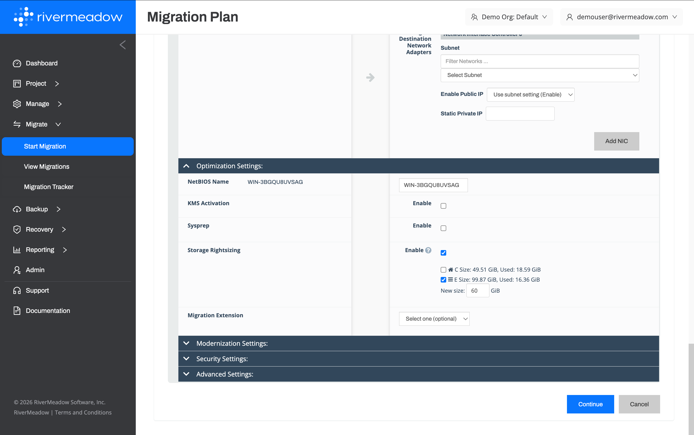
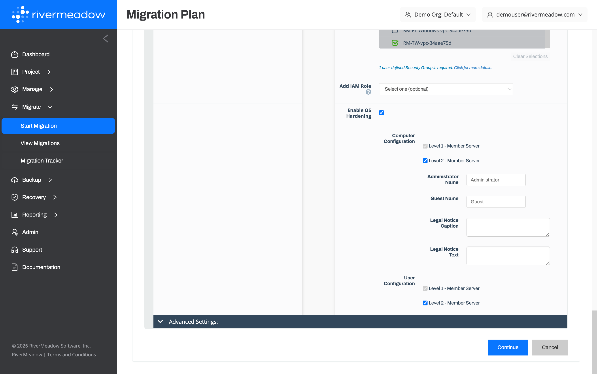

# Workload Optimization
---

There are multiple strategies for migrating workloads that range from a basic "lift and shift" migration of the workload to a complete refactoring of the application. Lift and shift migrations are the quickest and most straightforward way to migrate workloads as you are simply migrating the workload as is. The downside of this strategy is that the workload is typically unoptimized and that technical debt is being brought to the new environment.

### Storage Rightsizing

The RiverMeadow platform supports rightsizing the storage of virtual machines during the migration of the workload to reduce cloud costs and allocated storage.

**Storage Rightsizing**

#### Key Benefits

The following are key benefits of the storage rightsizing feature:

* **Reduced Cloud Costs:** Thin provisioning and capex procured storage arrays often results in overprovisioning that becomes costly when virtual machines are migrated to the public cloud due to storage being charged based on allocation and not usage. The ability to reduce the allocated storage to better align with the economics of the public cloud during the migration helps reduce overall cloud spend.

**Storage Rightsizing Examples**

The following are examples of storage optimization that can be completed utilizing the storage rightsizing feature:

  
**Windows Server 2019 VM with a 2 TB data drive**

  The server has been allocated 2 Terabytes or 2,000 Gigabytes on a data drive that needs to be migrated but the drive is only 20% utilized (400 GB) and would be a prime candidate for storage rightsizing to reduce the allocated storage of the migrated server.
  
---
  
  **Storage Rightsizing Monthly Savings**

  Original volume monthly costs = 2,000 GB x .06 = $120 USD per month
  
  Rightsized volume monthly costs = 1,200 GB x .06 per GB = $72 USD per month

  **Monthly storage savings = $120 - $72 = $48 USD per month**

  
**Red Hat Enterprise Linux (RHEL) VM with a 300 GB data drive**

  The server has been allocated 300 Gigabytes on a data drive that needs to be migrated but the drive is only 15% utilized (45 GB) and would be a prime candidate for storage rightsizing to reduce the allocated storage of the migrated server. The individual savings in this example is minimal but is a typical representation of standard workloads in an environment that could contain hundreds or thousands of servers. The minimal savings per server becomes a considerable savings when multiplied by hundreds or thousands of servers with similar profiles.
  
---
  
  **Storage Rightsizing Monthly Savings**

  Original volume monthly costs = 300 GB x .06 = $18 USD per month
  
  Rightsized volume monthly costs = 150 GB x .06 per GB = $9 USD per month

  **Monthly storage savings = $18 - $9 = $9 USD per month**

### Operating System (OS) Hardening

The RiverMeadow platform enables security hardening using CIS (Center for Information Security) benchmarks for Windows Server and Red Hat Enterprise Linux (RHEL) systems. This capability applies security best practices to the operating systems to improve system security.

**OS Hardening**

#### Key Benefits

The following are key benefits of the operating system hardening feature:

* **Improved Security:** Align the operating system with an industry standard bechmark to improve the system security during the workload migration.
* **Reduced Risk** The clone based methodology reduces the risk associated with potentially breaking applications due to operating system hardening. All of the hardening is performed on the clone of the source system to allow for testing prior to the cutover.

**OS Hardening Examples**

The following are examples of security hardening that can be completed utilizing the operating system hardening feature:

  
**Level 1 Hardening for Windows Server**

  Hardening of a Windows Server workload to apply level 1 controls from the CIS benchmark for Windows Server during the migration of the workload.

  
**Level 2 Hardening for Red Hat Enterprise Linux (RHEL)**

  Hardening of a Red Hat Enterprise Linux (RHEL) workload to apply level 2 controls from the CIS benchmark for RHEL during the migration of the workload.

