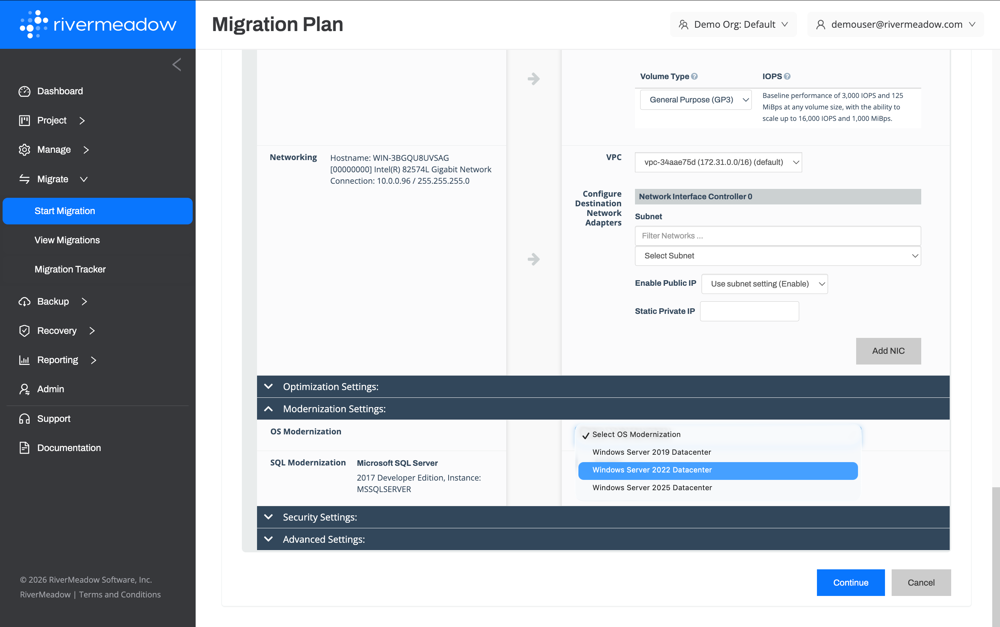

# Workload Modernization
---

One of the challenges that organizations face

### Operating System Modernization (OS Mod)
Linux and Windows operating systems

The RiverMeadow platform creates an exact copy of the source system and performs an automated upgrade of the operating system on the clone. 



#### Key Benefits

The following are key benefits of the operating system modernization feature:

* **Risk-free Upgrades**: The clone based methodology reduces the risk associated with in-place upgrades that rely on snapshots and commonly require an extended period of downtime simply for testing the upgrade.
* **Improved Security Posture**: Applying security patches to systems in a timely manner is one of the key pillars of IT security. Operating systems that have reached their end of life and no longer receive security patches from the vendor pose a significant risk to organizations.
* **Eliminate Microsoft ESUs**: Window Server operating systems that have reached the end of mainstream support enter a three (3) year period where they are eliglbe to receive security updates
* **Reduce Technical Debt**: Each operating system version that needs to be managed in an environment requires different considerations such as different patches, different security configurations, and more. Consolidating the number of operating systems in the environment streamlines operational tasks and considerations by only needing to worry about a few operating system versions.

**OS Modernization Examples**

The following are examples of modernization that can be completed utilizing the OS Modernization feature:

<details>
  <summary>**Windows Server 2008 R2 to Windows Server 2022**</summary>

  The Windows Server 2008 R2 operating system is an end of life product and is also no longer eligible for extended security updates. This poses a significant risk to the security posture of the organization and should be remediated as quickly as possible. Automate the upgrade from Windows Server 2008 R2 to Windows Server 2022 to

</details>


<details>
  <summary>**Red Hat Enterprise Linux 6.3 to Red Hat Enterprise Linux 9.2**</summary>

  This is the detailed content

  ```js
  console.log("Markdown features including the code block are available");
  ```

  You can use Markdown here including **bold** and _italic_ text, and [inline link](https://docusaurus.io)
</details>

<details>
  <summary>**SUSE Linux 12 to SUSE Linux 15**</summary>

  This is the detailed content

  You can use Markdown here including **bold** and _italic_ text, and [inline link](https://docusaurus.io)
</details>

:::tip

A detailed list of supported operating systems that can be upgraded is available in the RiverMeadow documentation: [https://docs.rivermeadow.com/support-matrix-for-os-modernization](https://docs.rivermeadow.com/support-matrix-for-os-modernization).

:::


### Microsoft SQL Server Modernization (SQL Mod)

Te

* **Improved Security Posture**: Applying security patches to systems in a timely manner is one of the key pillars of IT security. Operating systems that have reached their end of life and no longer receive security patches from the vendor pose a significant risk to organizations.
* **Eliminate Microsoft ESUs**: Microsoft SQL Server versions that have reached the end of mainstream support enter a three (3) year period where they are eliglbe to continue to receive security updates at an additional cost each year.
* **Reduce Technical Debt**: Each operating system version that needs to be managed in an environment requires different considerations such as different patches, different security configurations, and more. Consolidating the number of operating systems in the environment streamlines operational tasks and considerations by only needing to worry about a few operating system versions.

**SQL Modernization Examples**

The following are examples of conversions that can be completed utilizing the OS conversion feature:

<details>
  <summary>**Microsoft SQL Server 2012 to Microsoft SQL Server 2022**</summary>

  This is the detailed content

  ```js
  console.log("Markdown features including the code block are available");
  ```

  You can use Markdown here including **bold** and _italic_ text, and [inline link](https://docusaurus.io)
</details>

:::tip

A detailed list of the supported versions of Microsoft SQL Server that can be upgraded is available in the RiverMeadow documentation: (https://docs.rivermeadow.com/support-matrix-for-app-modernization)

:::

### Linux OS Conversion
Convert from one Linux distribution to another

#### Key Benefits

The following are key benefits of the automated operating system upgrade feature:

* **OS Consolidation**
* **Sunset Deprecated Operating Systems**: Applying security patches to systems in a timely manner is one of the key pillars of IT security. Operating systems that have reached their end of life and no longer receive security patches from the vendor pose a significant risk to organizations.

**Examples**

The following are examples of conversions that can be completed utilizing the OS conversion feature:

<details>
  <summary>**CentOS to Rocky Linux**</summary>

  CentOS was a popular . The linux conversion feature enables workloads running CentOS

</details>

<details>
  <summary>**Red Hat Enterprise Linux (RHEL) to Amazon Linux**</summary>

  Many organizations utilize Red Hat Enterprise Linux (RHEL) as the standard Linux distribution of choice in their on-premises estate. Amazon Linux is an rpm-based Linux distribution that is an alternative to Red Hat Enterprise Linux (RHEL) that is optimized for running on EC2. This provides an opportunity for organizations to eliminate their licensing costs for RHEL by transitioning to Amazon Linux. The conversion from Red Hat Enterprise Linux (RHEL) can be automated during the migration using the RiverMeadow platform's OS Conversion capablity. 

</details>

:::tip

A detailed list of supported Linux operating systems that can be converted is available in the RiverMeadow documentation: [https://docs.rivermeadow.com/support-matrix-for-os-modernization](https://docs.rivermeadow.com/support-matrix-for-os-modernization).

:::