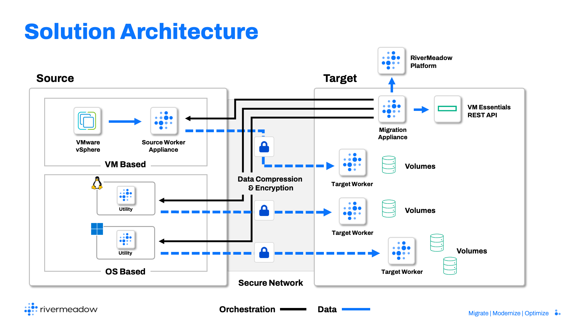

# Solution Architecture
---

**RiverMeadow Platform Architecture**

## Solution Components

The following components (VM based or OS based) are utilized in migrations to HPE Morpheus VM Essentials:

| Component | Description | Location | Migration Method |
|:-----------:|:-------------:|:----------:|:----------:|
| **Source Server** | The physical server, virtual machine, or cloud instance that will be migrated to HPE Morpheus VM Essentials. Direct ineraction with the source server occurs during OS based migrations. | Source Environment | OS Based |
| **VMware vCenter** | The VMware vSphere management server that provides the REST API for platform interaction. Direct interaction with the vCenter server occurs during VM based migrations. | Source Environment | VM Based |
| **VMware ESXi** | The VMware vSphere virtualization host that hosts the vSphere virtual machines. Direct interaction with the ESXi host occurs during VM based migrations. | Source Environment | VM Based |
| **HPE Morpheus VM Essentials Manager** | The HPE Morpheus VM Essentials manager is a virtual appliance that provides a centralized management server for managing multiple HVM clusters. The RiverMeadow solution integrates with the HPE Morpheus VM Essentials REST API hosted on the VM Essentials manager to automate the migration for servers to a managed HVM cluster. | Target Environment | OS and VM Based |
| **RiverMeadow Platform** | The RiverMeadow hosted platform is the control plane for the RiverMeadow solution and is responsible for migration orchestration, logging, and notifications. Interaction with the platform can be performed using the web interface (migrate.rivermeadow.com) or the platform REST API. | Internet | OS and VM Based |
| **RiverMeadow Migration Appliance** | The RiverMeadow migration appliance is a virtual appliance (virtual machine) that is deployed to an HVM cluster managed by an HPE Morpheus VM Essentials manager. The appliance is responsible for local migration orchestration operations such as provisioning HVM instances via the Morpheus REST API in tandem with RiverMeadow platform. | Target Environment | OS and VM Based |
| **RiverMeadow Source Worker Appliance** | The RiverMeadow source worker appliance is a virtual appliance (virtual machine) that is deployed into the source VMware vSphere deployment. The source worker appliance is responsible for mounting VMware virtual machine snapshots and facilitating the data transfer to target workers running on the HVM hypervisor. The appliance is automatically deployed into the source VMware vSphere environment from the RiverMeadow migration appliance. | Source Environment | VM Based |
| **RiverMeadow Migration Utility** | The RiverMeadow migration utility is a lightweight utility (less than 30 MB) that is deployed to the source Windows or Linux server for OS based migrations. The utility is responsible for metadata collection and data transfer to the corresponding target instance. The migration utility also enables the advanced optimization and modernization capabilities of the RiverMeadow platform. The utility does not require a reboot of the source system and can be automatically removed following the completion of the migration or modernization. | Source Environment | OS Based |
| **RiverMeadow Target Worker** | The RiverMeadow target worker is a minimal operating system image (Windows PE or Oracle Enterprise Linux) that is mounted to the target instance during the migration process (initial and delta). It is only used during the migration process and removed before the finalization of the migration. It is responsible for transferring data from the source server or source worker appliance and preparing the migrated server to run on the HVM hypervisor. | Target Environment | OS and VM Based |