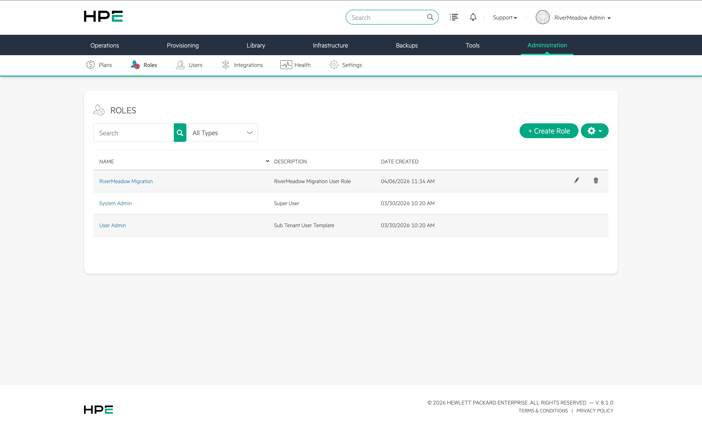
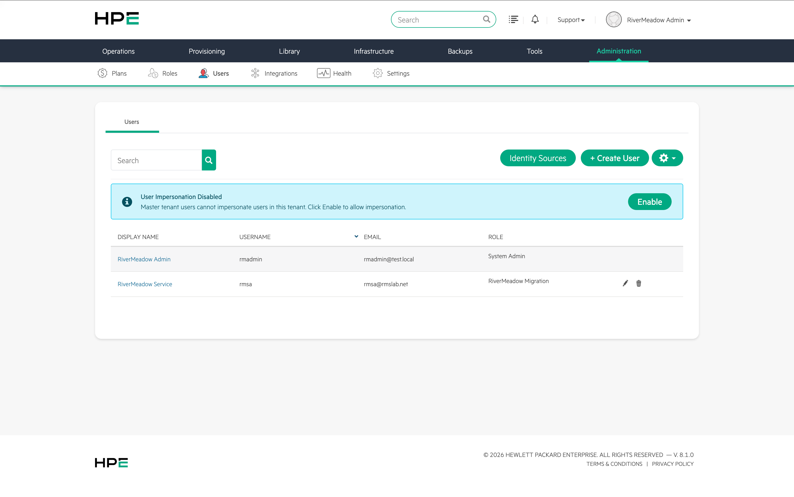
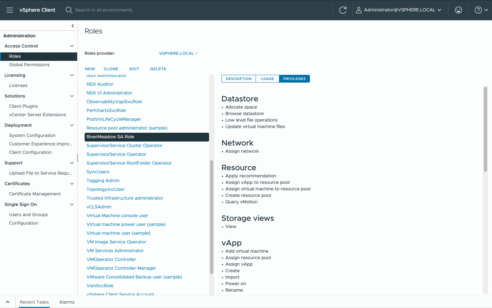

# Service Account Configuration
---

The RiverMeadow platform integrates with the HPE Morpheus VM Essentials and VMware vSphere to enable the migration of servers to HPE Morpheus VM Essentials from VMware vSphere or other sources. The platform requires credentials to interact with the respective platforms to perform the migration related operations.

## HPE Morpheus VM Essentials

The RiverMeadow platform utilizes the HPE Morpheus VM Essentials REST API to orchestrate the migration of workloads to the HVM hypervisor. The security best practice is to create a dedicated service account that will be used by the RiverMeadow Meadow migration appliance to interact with the REST API. This service account should be granted only the privileges that are required to ensure that it aligns with the security principle of least privilege.

### User Role

A dedicated user role should be created to assign the required privileges to the user account. Privileges or permissions within HPE Morpheus VM Essentials are associated with a user role for assignment. View the required [role privileges](#role-privileges) that need to be granted to the user role.

### Role Privileges

The following privileges are required by the HPE Morpheus VM Essentials user role to migrate workloads using the RiverMeadow platform:

  
**HPE Morpheus VM Essentials Role Privileges**

  Licensing costs for VMware vSphere is forcing organizations to look for alternatives and AWS EC2 provides robust and battle tested IaaS solution for migrating workloads to as part of a VMware exit. 

| Privilege | Access Level | Notes |
|:--------------------|:--------------------------:|:-----:|
| Backup Settings |	Full | |
| Environment Settings | Full | |
| Provisioning Settings | Full |
| Roles | Full |
| Service Plans	| Read |
| Clusters | Full | Access clusters |
| Compute | Full |
| Groups | Full |
| Networks | Read |
| Storage | Read |
| Virtual Images | Full |
| Power Control | Full | Manage the power state of an existing instance |
| Reconfigure | Full |
| Reconfigure: Change Plan | Full | Modify the instance service plan (hardware configuration) associated with an existing instance |
| Reconfigure: Disk Add | Full | Add a new disk to an existing instance |
| Reconfigure: Disk Change Type	| Full | Change the disk type of a disk associated with an existing instance |
| Reconfigure: Disk Modify | Full | Modify a disk attached to an existing instance |
| Reconfigure: Disk Remove | Full | Remove or detach a disk from an existing instance |
| Reconfigure: Network Add | Full |  Add or attach a network interface to an existing instance |
| Reconfigure: Network Modify | Full | Modify a network interface attached to an existing instance |
| Reconfigure: Network Remove | Full | Remove a network interface from an existing instance |
| Retry/Cancel | Full | Retry or cancel |
| Activity | Read |
| Dashboard | Read | Read the details from the VM Essentials dashboard |
| Import Image | Full |
| Instances: Add | Full |
| Instances: Clone | Full | Clone an existing instance |
| Instances: Delete | Full | Delete an existing instance |
| Instances: Edit | Full |
| Instances: List | Full | List all existing instances |
| Instances: Settings | Full |
| Remote Console | User |
| Snapshots | Full | Manage instance snapshots (create, delete, etc.) |
| Snapshots: Linked Clone | Full | Manage an instance linked clone |

:::tip

The most current version of the required privileges is available in the RiverMeadow documentation: [https://docs.rivermeadow.com/hpe-vme-required-privileges](https://docs.rivermeadow.com/hpe-vme-required-privileges).

:::

### User Account

A dedicated user account (local or external identity provider) should be created in the HPE Morpheus VM Essentials platform with a secure password for use by the RiverMeadow migration appliance.

## VMware vSphere (VM Based - Optional)

The RiverMeadow platform supports VM based migrations from VMware vSphere to HPE Morpheus VM Essentials using a hypervisor-level integration. A user account with elevated privileges to the source VMware vSphere environment is required for VM based migrations. This service account is used to automate the deployment of the source worker appliance and execute migration related activities such as creating snapshots.

  
**VMware vSphere Role Privileges**

