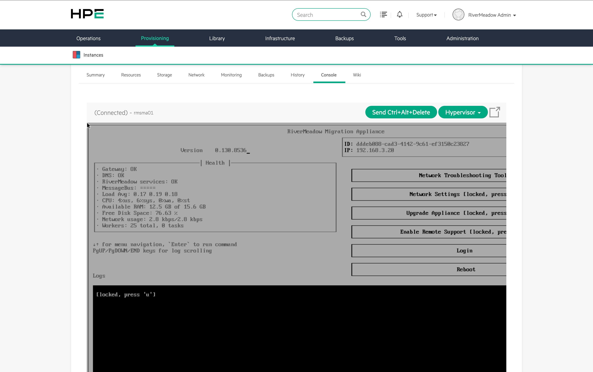
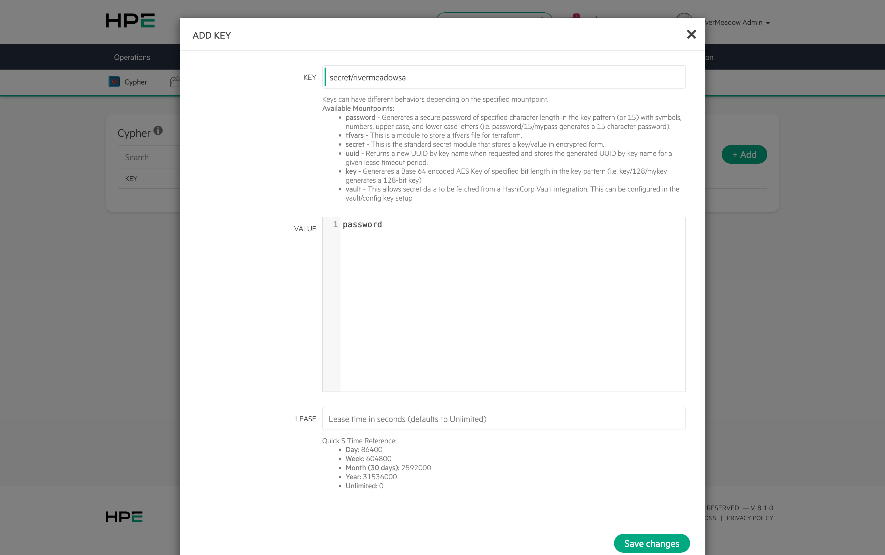
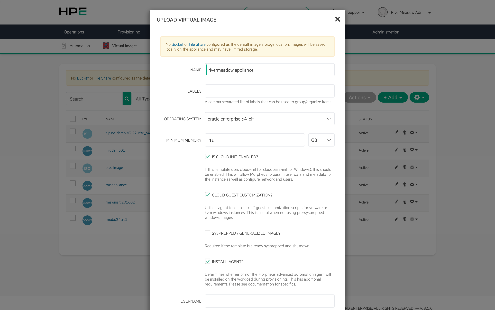
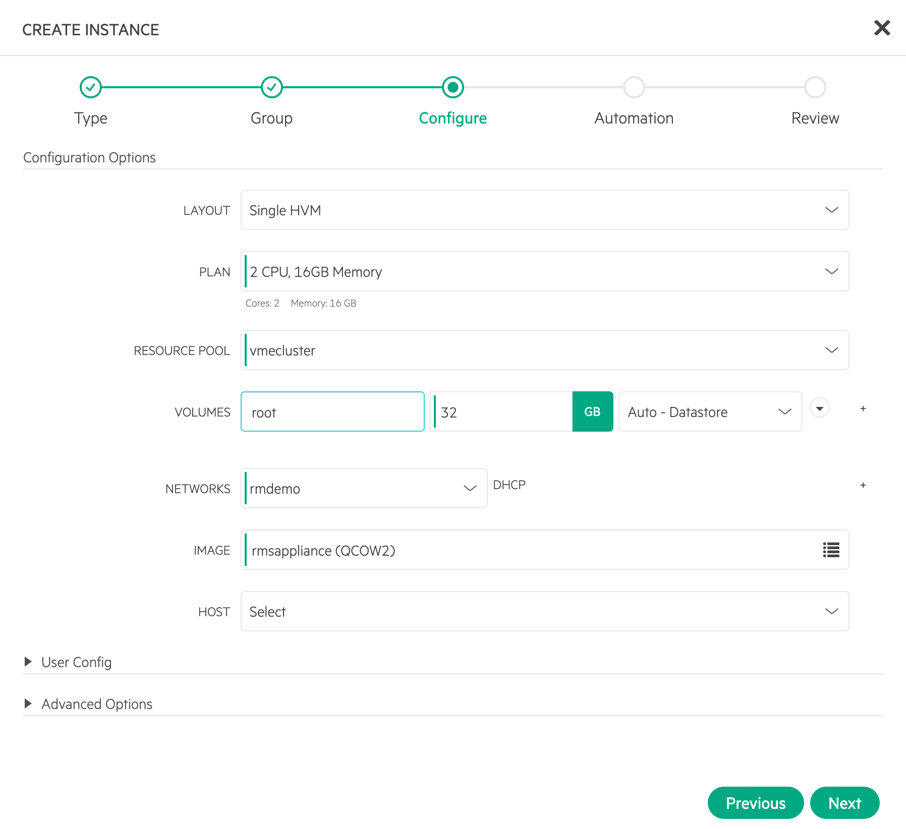
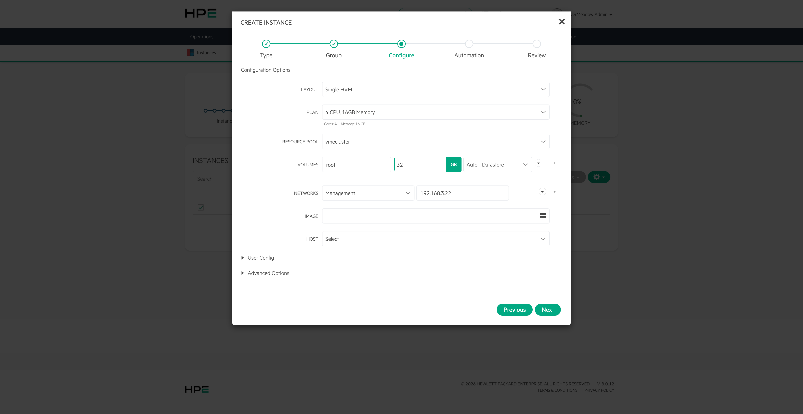
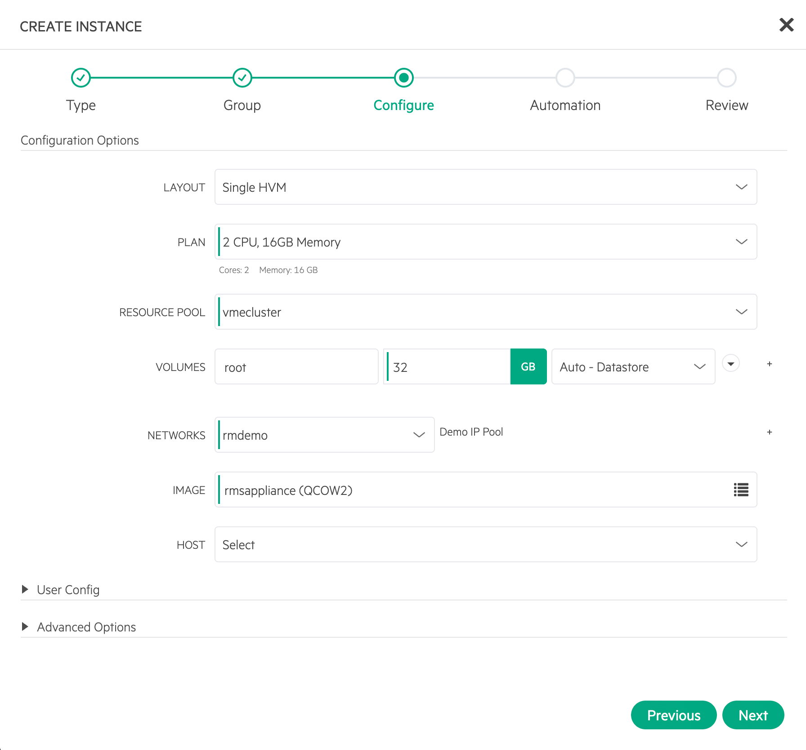

import Tabs from '@theme/Tabs';
import TabItem from '@theme/TabItem';


# Migration Appliance
---

The RiverMeadow migration appliance is a virtual appliance packaged as a QCOW2 image file that is downloaded via the RiverMeadow platform and deployed on an HVM cluster in the target environment. The appliance runs a hardened version of Oracle Enterprise Linux (OEL) 9.



### Hardware Requirements

The virtual appliance requires the following hardware:

* **CPU:** 2 Cores
* **Memory:** 16 GB
* **Disk Space:** 32 GB

### Appliance Download
The migration appliance is downloaded from the RiverMeadow platform (migrate.rivermeadow.com) and is bundled in a ZIP file that contains the QCOW2 image used to deploy the migration appliance.

## Configuration

The configuration settings for the RiverMeadow migration appliance are defined using a YAML file that is attached to the virtual image used to deploy the migration appliance instance.

### Secure Credential Handling (Cypher Secret)

The credentials for interacting with the Morpheus REST API enable privileged access to the platform and should be securely handled to avoid exposure. The credentials can be securely stored in the native VM Essentials secrets management solution (Cypher) to avoid the credentials being exposed in plain text in the user interface. Once the secret is created in Cypher, it can then be referenced in the appliance configuration settings to avoid cleartext passwords.



### Configuration Settings

The general configuration settings

| Name | Details |
|:------:|---------|
| **url** | The URL of the HPE Morpheus VM Essentials manager. Using the IP address of the manager ensures that DNS resolution of the manager does not cause any potential issues. |
| **username** | The username of the user account used to authenticate to the HPE Morpheus VM Essentials manager. |
| **password** | The password of the user account used to authenticate to the HPE Morpheus VM Essentials manager. |
| **token** | The auto-populated token used by the migration appliance to authenticate to the RiverMeadow platform. The token is unique to each migration appliance. **DO NOT EDIT** |

### Example Config

The following is an example configuration file for configuring the migration appliance to enable VM based migrations and automate the deployment of the source worker appliance.

```yaml
#cloud-config

# Description of the configuration parameters for the appliance

# NOTE: YAML only supports *straight* single or double quotes.
#       Curly quotes should not be used.
# Following entries configure HPE Morpheus API connection details
# URL format examples (if a port is not specified, 443 is assumed):
#   https://abc.com:443
#   https://abc.com
#   url
#   username
#   password
url: 'https://172.16.200.10'
username: 'admin'
password: 'password'

token: eJzDwoaXDIq1r8gOlajyn2SqrMsTiPCq...
```

## Virtual Image

The migration appliance is deployed from a virtual image within the HPE Morpheus VM Essentials deployment. The virtual image 

[VME Documentation](https://docs.rivermeadow.com/hpe-vme-standalone-launch-mig)



## IP Addressing

The network configuration for RiverMeadow migration appliance is managed by cloud-init during the appliance boot process. HPE Morpheus VM Essentials supports passing network configuration data to instances during the provisioning process. The following IP address assignment methods are supported by the migration appliance.

<Tabs>
  <TabItem value="dhcp" label="DHCP" default>
The RiverMeadow migration appliance can be assigned a dynamic IP address during instance provisioning if there is a DHCP server available on the network where the appliance is being deployed.



  </TabItem>
  <TabItem value="static" label="Static">

The RiverMeadow migration appliance can be assigned a static IP address during instance provisioning by explicitly assigning an IP address to the network interface. The IP address is populated in the text box next to the network drop-down in the HPE Morpheus VM Essentials web interface.



:::warning
The subnet mask, default gateway, and DNS servers must be assigned to the network that the migration appliance is being deployed.
:::

  </TabItem>
  <TabItem value="native-pool" label="Native IP Pool">
HPE Morpheus VM Essentials supports managing IP addresses using native IP pools that allow administrators to define a range of IP addresses that will be allocated to instances during the provisioning process. Selecting the VM Essentials network with an associated IP pool is the only configuration required during the instance provisioning process.



:::warning
The subnet mask, default gateway, and DNS servers must be assigned to the network that the migration appliance is being deployed.
:::
  </TabItem>

  <TabItem value="3rd-party-ipam" label="3rd Party IPAM">

HPE Morpheus VM Essentials supports integrating with 3rd party IPAM solutions such as BlueCat, InfoBlox, PHPIpam and others to automate the management of IP addresses for provisionined instances.
  </TabItem>

</Tabs>

## Multiple HVM Clusters
A single VM Essentials manager can support managing multiple clusters (i.e. - dev, prod, etc.). The RiverMeadow platform supports migrations to HPE Morpheus VM Essentials environments running multiple HVM clusers. Only a single RiverMeadow migration appliance is required if multiple HVM clusters are added to a single VM Essentials manager.

## Multiple Migration Appliances
The RiverMeadow migration appliance supports the majority of use cases with a single migration appliance

### Multiple VM Essentials Managers
The RiverMeadow migration appliance is tied in a 1:1 fashion with a VM Essentials manager. The mapping is due to the identity integration

### Role Based Access Control
The RiverMeadow migration appliance is tied in a 1:1 fashion with a RiverMeadow project. This necessitates the need to deploy multiple migration appliances if there is a need to support multiple projects within a RiverMeadow organization.