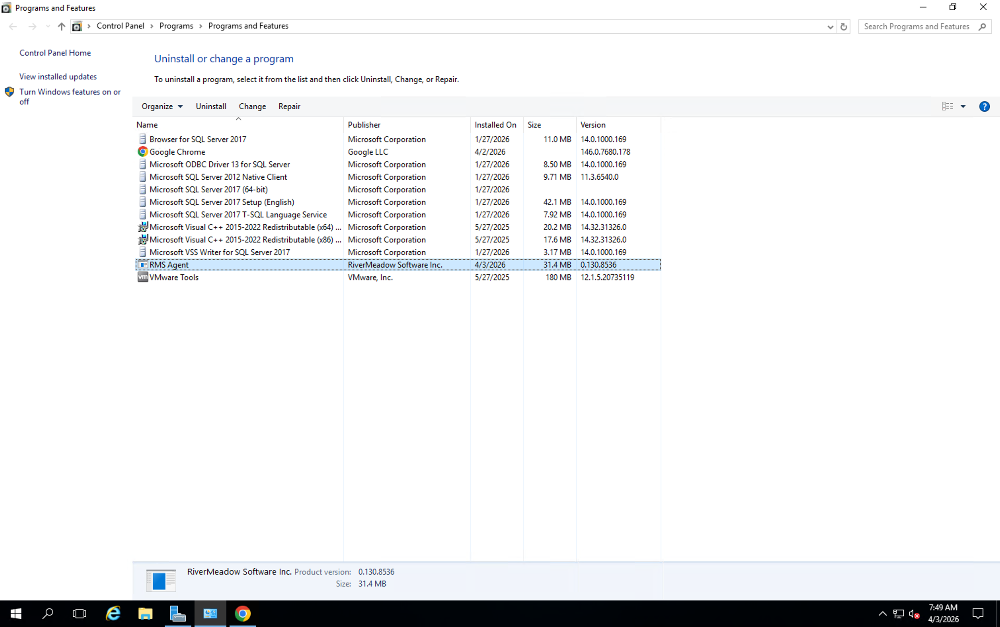
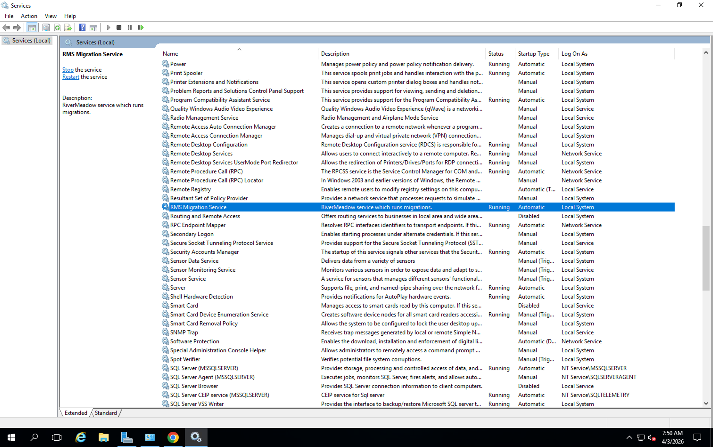
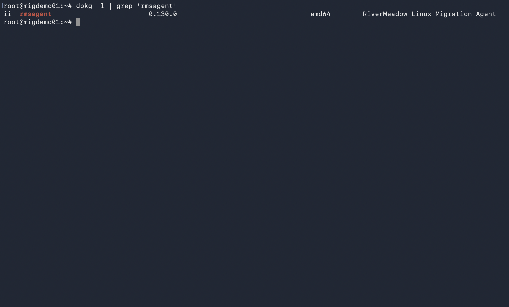
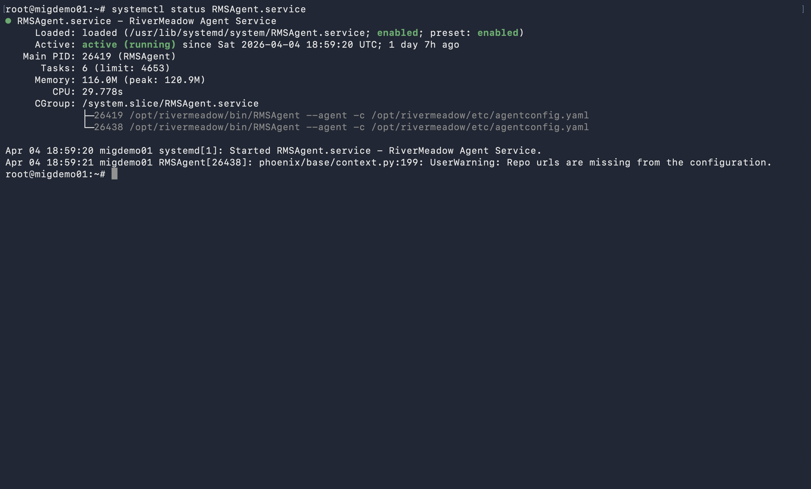

# Migration Utility Deployment (DONE)
---
The RiverMeadow migration utility is a lightweight utility (less than 30 MB) that is deployed to each Windows or Linux source server that is migrated using OS based migrations. The migration utility enables advanced optimization and modernization functionality during the workload migration.

## Automated Deployment
The migration utility can be automatically deployed from the migration appliance that is deployed into the target environment. The migration appliance uses standard remote management protocols (SSH, WinRM, SMB) to connect to the source server and perform the utility deployment. Adminstrative credentials to the source server must be provided to perform the migration utility deployment.

The source server IP address and credentials should be provided when adding the source server to the RiverMeadow source inventory. The migration utility deployment is performed during the initial source inspection process.

## Manual Deployment
The migration utility can also be manually deployed by downloading the migration utility package from the migration appliance. This also enables the utility to be rolled out across an environment using 3rd party automation tools like Ansible or Group Policy.

### Utility Download
The RiverMeadow migration utility artifact can be downloaded from the migration appliance that is deployed into the target environment. The agent downloads page is accessible at the following URL: https://rms_migration_appliance_ip_address:8888/agent.

## Deployment Verification

The successful deployment and configuration of the migration utility can be verified by ensuring that the package has been installed and that the associated service has started.

### Windows Operating System
The migration utility is installed using an MSI file for Windows operating systems. The application is listed as **RMS Agent** under the operating systems installed programs.

The deployment of the migration utility will also configure a Windows service named **RMS Migration Service** that will automatically start following the successful deployment and listen on TCP port 5994.

### Linux Operating System
The migration utility is installed using a distribution specific package for Linux operating systems (i.e. - .deb, .rpm, etc.). The application is listed as **rmsagent** under the operating systems installed programs.

The deployment of the migration utility will also configure a Linux service named **RMSAgent** that will automatically start following the successful deployment and listen on TCP port 5994.

