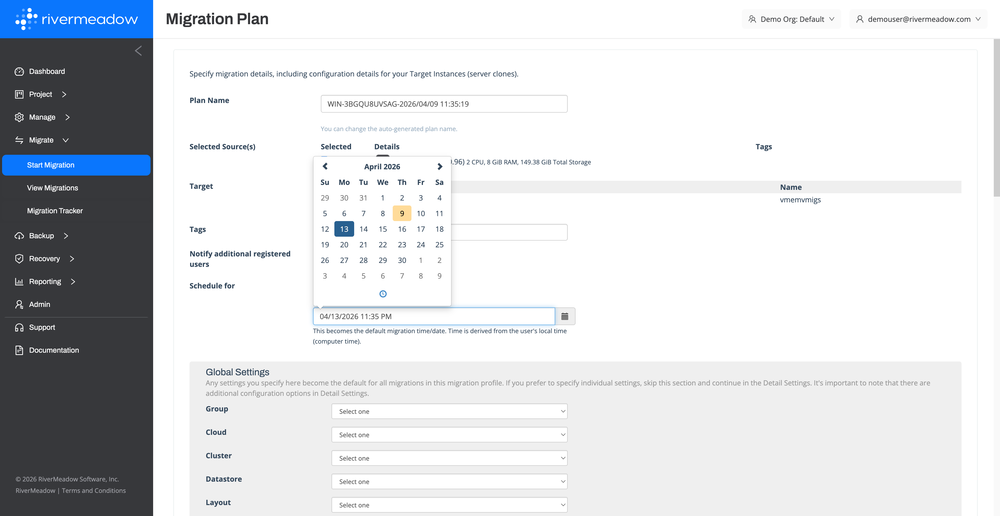
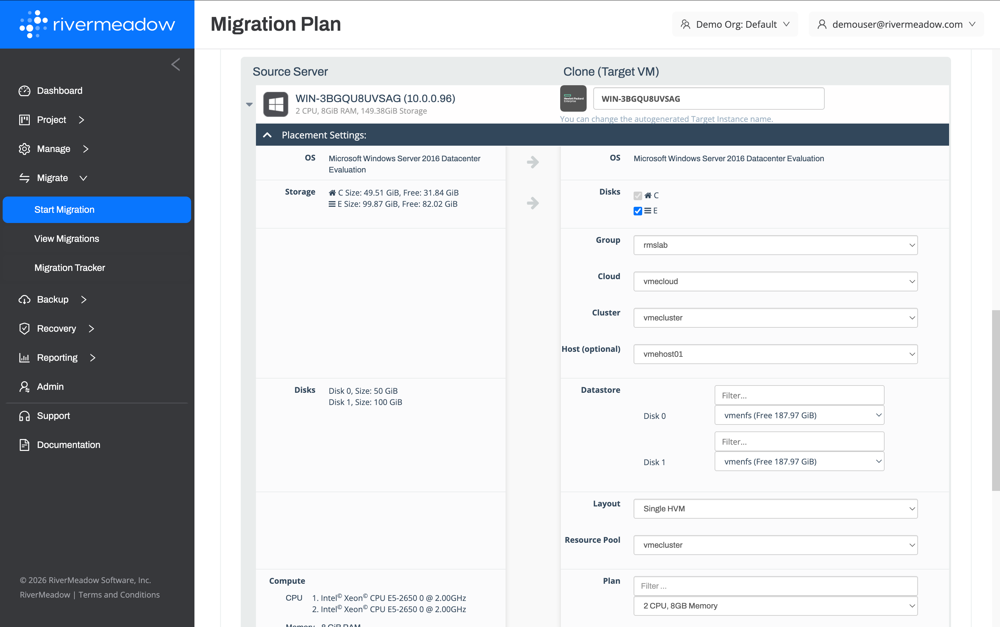
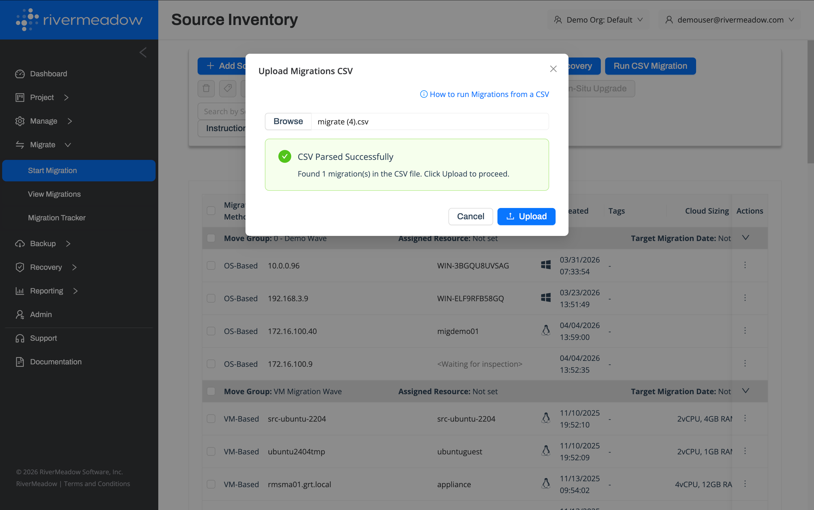

# Initial Migration
---
The initial migration of a server creates a new instance in HPE Morpheus VM Essentials and replicates the data from the source server. Once the initial migration or sync completes then initial testing and validation of the instance can be performed as a "smoke" test to check basic functionality.

## Migration Profile
The migration profile defines the plan or configuration for migrating a server from the source environment to the target environment.

### Migration Schedule

The initial migration can be scheduled to start at a future date and time to enable the initial sync or migration to be perform during off-hours. This can be planned to reduce any potential environment impact due to network utilization or other considerations.

### Server Settings

The initial migration defines the configuration details for how the server will be migrated, optimization, and/or modernized to HPE Morpheus VM Essentials. This includes details such as how the new instance will be created along with optimization and modernization settings.

  
**Placement Settings**

The placement settings within the migration profile define the configuration related to how the new instance will be created in HPE Morpheus VM Essentials.

| Name | Description | Supported Migration Methods |
|:------:|:-------------:|:--------:|
| **Group**| The VM Essentials group where the migrated server will be created. | OS, VM |
| **Cloud**| The VM Essentials cloud where the migrated server will be created. |  OS, VM |
| **Cluster**| The VM Essentials cluster where the migrated server will be created. |  OS, VM |
| **Host (Optional)**| The VM Essentials HVM cluster host where the migrated server will be created. |  OS, VM |
| **Datastore**| The VM Essentials cluster datastore where the migrated server disk(s) will be created. |  OS, VM |
| **Layout**| The VM Essentials instance layout the migrated server will be created with. |  OS, VM |
| **Resource Pool**| The VM Essentials resource pool (cluster) where the migrated server will be created. |  OS, VM |
| **Plan**| The VM Essentials service plan the migrated server will be created with. |  OS, VM |
| **Network Adapter**| The network configuration for the attached network interfaces. |  OS, VM |

  
**Optimization Settings**

The optimization settings within the migration profile define the configuration related to how the instance will be optimized during the migration to HPE Morpheus VM Essentials.

| Name | Description | Supported Migration Methods |
|:------:|:-------------:|:--------:|
| **NetBIOS Name (Windows Only)**| The new NetBIOS name for the migrated Windows server  |  OS |
| **Sysprep (Windows Only)** | Whether to sysprep the Windows system during the migration  |  OS |
| **Storage Rightsizing** | Whether to adjust the storage allocated to the target instance volumes  |  OS |
| **Migration Extension** | The migration extension to associate with the instance to perform post-migration automation using an uploaded Bash or PowerShell script |  OS, VM |

  
**Modernization Settings**

The modernization settings within the migration profile define the configuration related to how the instance will be modernized during the migration to HPE Morpheus VM Essentials.

| Name | Description | Supported Migration Methods |
|:------:|:------:|:-----------------:|
| **OS Modernization**| The operating system version to upgrade the target system to during the migration or the Linux distribution to convert the target system to during the migration | OS |
| **SQL Modernization (Windows Only)** | The Microsoft SQL Server version to upgrade the SQL Server to during the server migration  | OS |

  
**Security Settings**

The security settings within the migration profile define the configuration related to how the instance will be secured during the migration to HPE Morpheus VM Essentials.

| Name | Description | Supported Migration Methods |
|:------:|:-------------:|:--------:|
| **Enable OS Hardening** | Whether to harden the Windows Server or RHEL operating system of the target instance using CIS benchmarks | OS |

  
**Advanced Settings**

The advanced settings within the migration profile define the advanced configuration related to how the instance will be migrated to HPE Morpheus VM Essentials.

| Name | Description | Migration Methods |
|:------:|:-------------:|:--------:|
| **Remove RMS Agent Post Migration** | Whether to remove the RiverMeadow migration utility following the successful migration of the server to HPE Morpheus VM Essentials | OS |
| **Source Shutdownn** | Whether to remove the RiverMeadow migration utility following the successful migration of the server to HPE Morpheus VM Essentials | OS, VM |
| **Target Shutdown** | Whether to remove the RiverMeadow migration utility following the successful migration of the server to HPE Morpheus VM Essentials | OS, VM |
| **Finalize Migration** | Whether to "finalize" the VM based migration by removing the snapshot from the target instance in HPE Morpheus VM Essentials in preparation for a cutover event. | VM |

## CSV Bulk Migration

Migrations in bulk to HPE Morpheus VM Essentials can be defined using a CSV file that contains all of the configuration data required by the migration profile. A template CSV file can be generated by filling out a migration profile using the RiverMeadow portal and clicking on the download migration csv link that is available after clicking on the start migration button on the migration profile.

