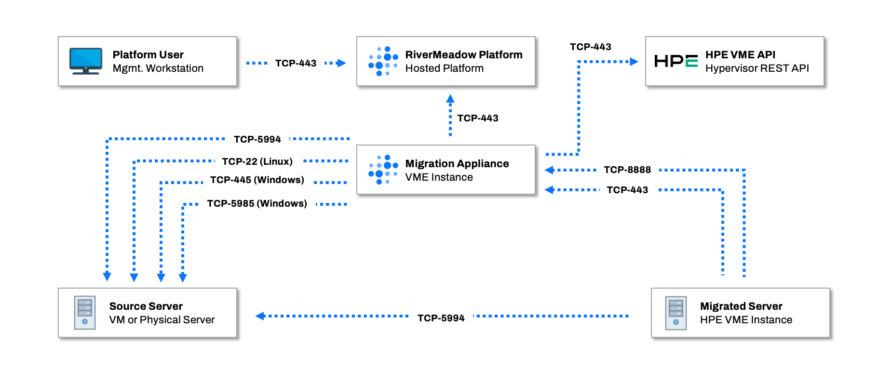
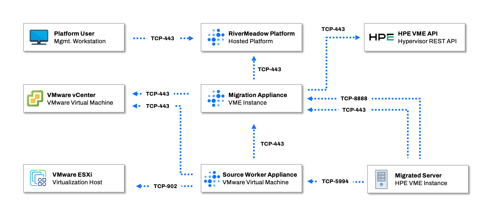

# Network Ports and Protocols

Network communication between the RiverMeadow solution components is critical to enable successful migrations to HPE Morpheus VM Essentials. This section of the courses details the network ports and protocols required for the different migration methods (VM based and OS based) available with the platform.

### OS Based Migration Ports and Protocols

The following table details the network ports and protocols that must be opened to ensure proper network communication for OS based migrations.

| Source | Target | Port | Protocol | Notes |
|:--------:|:--------:|:-------:|:----------:|-------|
| Admin Workstation | RiverMeadow Platform | 443 | TCP | UI and API access for administrator management activities |
| RiverMeadow Migration Appliance | RiverMeadow Platform | 443 | TCP | Control plane communication for migration orchestration |
| RiverMeadow Migration Appliance | HPE Morpheus VM Essentials Manager | 443 | TCP | API access to the VM Essentials Manager for migration automation |
| RiverMeadow Migration Appliance | Source Server (Windows) | 5985 | TCP | Automated migration utility deployment for Windows (WinRM). ***This port is optional if the utility is preinstalled*** |
| RiverMeadow Migration Appliance | Source Server (Windows) | 445 | TCP | Automated migration utility deployment for Windows (SMB). ***This port is optional if the utility is preinstalled*** |
| RiverMeadow Migration Appliance | Source Server (Linux) | 22 | TCP | Automated migration utility deployment for Linux (SSH). ***This port is optional if the utility is preinstalled*** |
| RiverMeadow Migration Appliance | Source Server | 5994 | TCP | Source inspection to collect system metadata |
| RiverMeadow Target Worker | RiverMeadow Migration Appliance | 443 | TCP | Control plane communication for migration orchestration (message bus) |
| RiverMeadow Target Worker | RiverMeadow Migration Appliance | 8888 | TCP | Control plane communication for migration orchestration (api access) |
| RiverMeadow Target Worker | Source Server | 5994 | TCP | Data replication from the source server to target instance |

### VM Based Migration Ports and Protocols

The following table details the network ports and protocols that must be opened to ensure proper network communication for VM based migrations.

| Source | Target | Port | Protocol | Notes |
|:--------:|:--------:|:-------:|:----------:|-------|
| Admin Workstation | RiverMeadow Platform | 443 | TCP | UI and API access for administrator management activities |
| RiverMeadow Migration Appliance | RiverMeadow Platform | 443 | TCP | Control plane communication for migration orchestration |
| RiverMeadow Migration Appliance | HPE Morpheus VM Essentials Manager | 443 | TCP | API access to the VM Essentials Manager for migration automation |
| RiverMeadow Migration Appliance | Source VMware vCenter Server | 443 | TCP | API access to the source VMware vCenter Server |
| RiverMeadow Source Worker Appliance | RiverMeadow Migration Appliance | 8888 | TCP | Control plane communication for migration orchestration |
| RiverMeadow Source Worker Appliance | VMware ESXi Hosts | 902 | TCP | ESXi host data transfer (NBDSSL) |
| RiverMeadow Source Worker Appliance | Source VMware vCenter | 443 | TCP | API access to the source VMware vCenter Server |
| RiverMeadow Target Worker | RiverMeadow Migration Appliance | 443 | TCP | Control plane communication for migration orchestration (message bus) |
| RiverMeadow Target Worker | RiverMeadow Migration Appliance | 8888 | TCP | Control plane communication for migration orchestration (api access) |
| RiverMeadow Target Worker | RiverMeadow Source Worker Appliance | 5994 | TCP | Data replication from the source worker appliance to target instance |