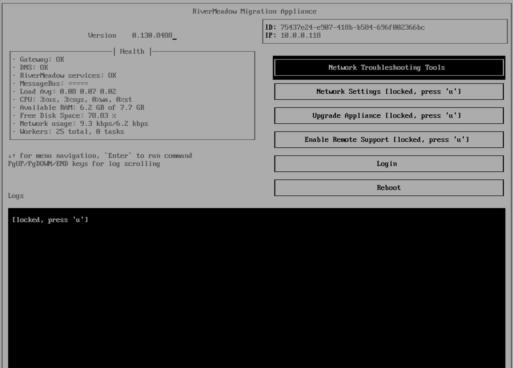
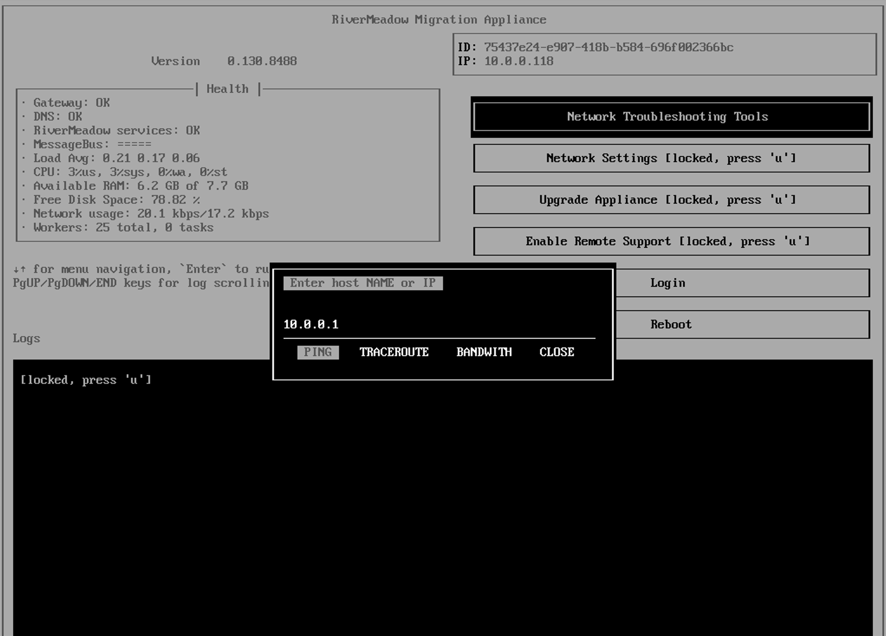
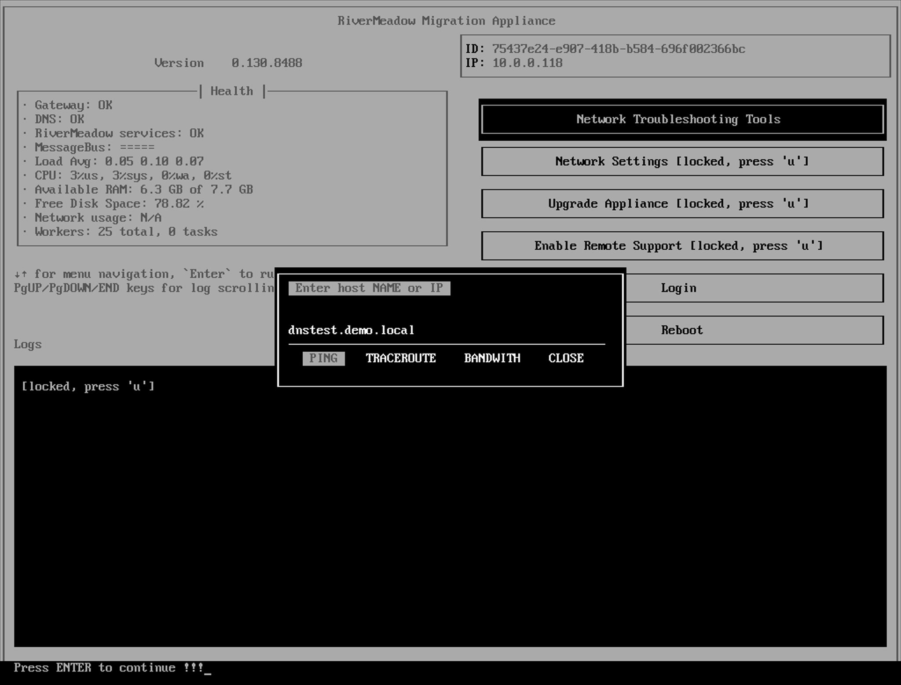
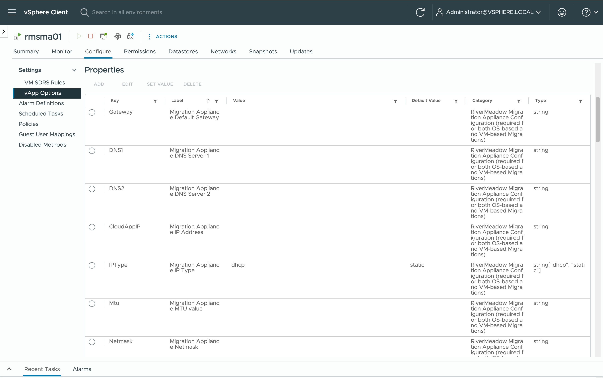

# Migration Appliance Troubleshooting

The RiverMeadow migration appliance is an essential control plane component that is responsible for orchestrating the migration process. This guide covers details on troubleshooting the deployment and configuration of the migration appliance.

* [Local Network Connectivity](#local-network-connectivity)
* [Name Resolution](#name-resolution)
* [External Network Connectivity](#external-network-connectivity)
* [Appliance Configuration Data](#appliance-configuration-data)

## Local Network Connectivity

This section of the guide details troubleshooting steps to verify that the migration appliance has local network connectivity.

**Does the migration appliance have an IP address assigned?**

The migration appliance must have an IP address assigned in order to establish connectivity to even the local network where the appliance is deployed. The TUI (Text User Interface) of the appliance should show an IP address assigned to the migration by accessing the console from the cloud console or virtualization platform management server.

**Can the migration appliance reach other systems on the local network?**

The migration appliance needs to be able to reach other systems on the local network or the network's gateway in order to reach other local subnets or VLANs. The migration appliance includes network troubleshooting tools to perform common operations such as an ICMP Ping or Traceroute to assess network reachability. The tools can be accessed from the appliance TUI (Text User Interface) using the VM or instance console that can be reached from the cloud console or virtualization platform management server.

## Name Resolution

This section of the guide details troubleshooting steps to verify that the migration appliance can properly resolve any hostname or DNS names used in the appliance configuration.

**Can the migration appliance resolve the hostname associated with the target REST API?**

The RiverMeadow platform supports migrating workloads to virtualization platforms (vSphere, HPE Morpheus VM Essentials, Nutanix, Hyper-V, and OpenStack) where the migration appliance interacts with the virtualization platform's REST API to orchestrate the migration process. In scenarios where a hostname or FQDN is utilized in the configuration for the REST API, the migration appliance must be able to resolve the hostname. The migration appliance includes network troubleshooting tools that can be used to verify DNS resolution. The tools can be accessed from the appliance TUI (Text User Interface) using the VM or instance console that can be reached from the cloud console or virtualization platform management server.

The following screenshot shows an example of failed name resolution in which the appliance is unable to resolve the hostname provided for the ping operation. Successful name resolution should result in either successful ping responses or a timeout due to network reachability but not name resolution.

**Can the migration appliance resolve migrate.rivermeadow.com?**

The RiverMeadow migration appliance communicates with the RiverMeadow platform using the migrate.rivermeadow.com hostname and needs to be able to properly resolve the DNS name associated to properly connect.

## External Network Connectivity

This section of the guide details troubleshooting steps to verify that the migration appliance has external network connectivity to reach the RiverMeadow hosted platform.

## Appliance Configuration Data
This section of the guide details troubleshooting steps to verify that the migration appliance has been properly configured.

### VMware vSphere

The configuration data for the RiverMeadow migration appliance when deployed to VMware vSphere is applied via OVF properties. This allows the migration appliance to read the configuration data during the initial appliance bootstrap process as well as after appliance reboots.

### HPE Morpheus VM Essentials

The configuration data for the RiverMeadow migration appliance for HPE Morpheus VM Essentials is applied via the user data associated with the virtual image. This allows the migration to read the configuration data during the initial appliance bootstrap process.

:::warning
Updates to the migration appliance configuration require a redeployment of the migration appliance and any associated source worker appliances.
:::

### Microsoft Hyper-V

The configuration data for the RiverMeadow migration appliance for Microsoft Hyper-V is applied via the Hyper-V Data Exchange service (KVP). This allows the migration to read the configuration data during the appliance boot process.